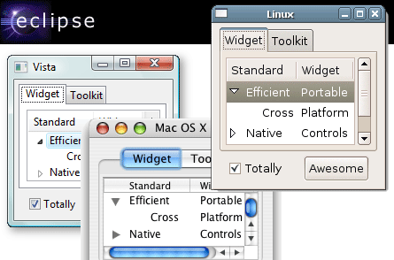
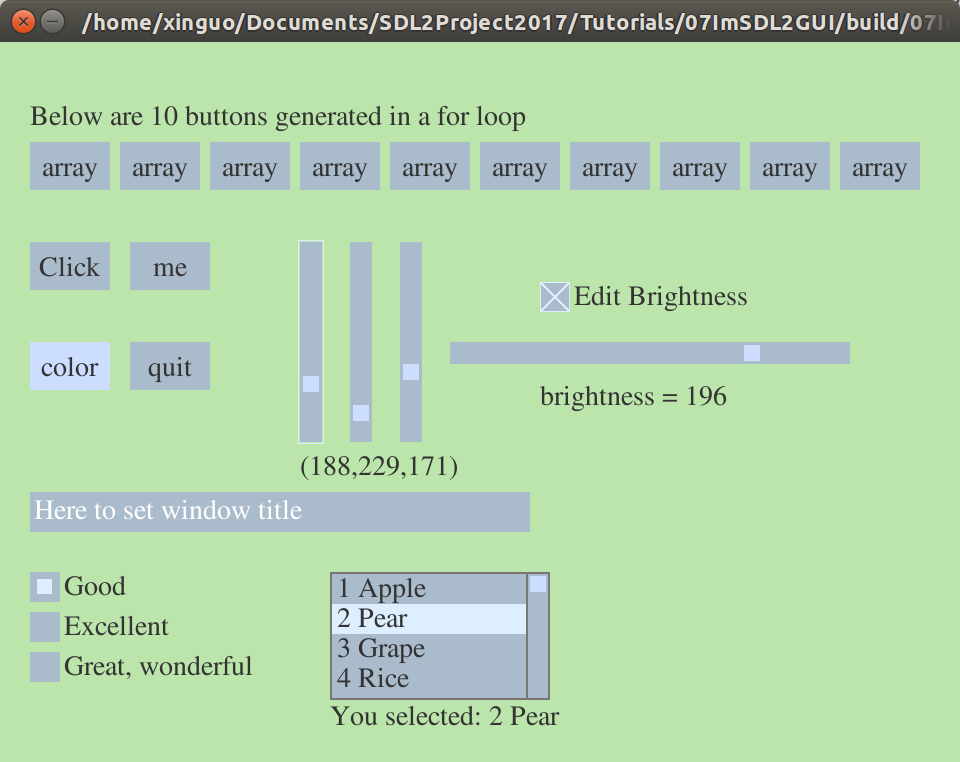

# IMGUI - Immediate Mode Graphics User Interface

<div align=center>
刘新国
xgliu@cad.zju.edu.cn
浙江大学计算机学院，浙江大学CAD&CG国家重点实验室
2017年5月22日，第一稿

</div>


在传统的典型GUI中，与应用程序进行交互一般是通过**组件**（widget）完成。使用组件过程比较繁琐，包括：创建组件，显示组件，查询组件，向组件发送消息和数据，清理组件。尽管可以通过一些**所见即所得**的可视手段帮助我们完成一些步骤，但是仍然需要我们编写和维护大量代码：初始化组件，设计回调函数，清理组件。 

<div align=center>

Windows, Mac OS X, Linux系统中一些GUI组件
</div>

标准的GUI组件库一般包含以下几种：
- text label
- button
- radio
- checkbox
- editbox
- listbox
- combolist

目前绝大部分应用程序采用的是这种传统的GUI模式，称为RMGUI（Retained Mode Graphics User Interface）。但是对于游戏类的应用程序，以及高画面刷新率的应用程序而言，传统的GUI模式显得非常繁琐。为此，xxx在2003年提出了一种新的GUI模式，即：Immediate Mode Graphics User Interface，简称IMGUI。IMGUI的核心思想是：没一个组建都由一个函数完成所有的工作，包括：维护状态，读取数据，绘制形状。

在IMGUI中，使用一个button典型方式如下：
```
if (button(ID, posx, posy, width, height, label)) 
{
	do_something(); //该按钮被按下，执行相应任务
}
```

<div align=center>


IMGUI组件演示
</div>

### GUI状态变量
考虑我们与计算机/应用程序进行交互的两个主要工具：鼠标和键盘。在交互过程中，我们需要知道他们的一些简单的状态信息。具体的数据结构如下：
```
typedef struct 
{
	int mousex;     // x - mouse position 鼠标x坐标
	int mousey;     // y - mouse position 鼠标y坐标
	int mousedown;  // 1 - yes, 0 - no 是否按下鼠标

	int hotitem;    // widget below the mouse cursor 光标下的组件ID
	int activeitem; // widget under interaction 正在交互的组件ID

	int keypressed; // key that was pressed 被按下的普通键
	int keymod;     // key modifier (alt，ctrl, shift) 修饰键
	int keychar;    // char that is input 输入的字符（ASCII码）

	int lastwidget; // last widget that was processed 上一个接受键盘的组件
	int kbditem;    // widget with keyboard focus 接受键盘输入的组件ID
}
UIState;

UIState gUIState;
```

其中 **gUIState**是一个记录状态信息的全局变量。这个全局的状态变量在使用之前需要进行初始化：
```
void imgui_init()
{
	memset(&gUIState,0,sizeof(gUIState));
}
。
```
这里我们将所有的成员变量初始化为0。

在SDL程序中，记录键盘和鼠标状态的代码如下：
```
int imgui_update(SDL_Event* e)
{
	switch (e->type) {
		case SDL_MOUSEMOTION:
			// update mouse position
			gUIState.mousex = e->motion.x;
			gUIState.mousey = e->motion.y;
			return 1;
		case SDL_MOUSEBUTTONDOWN:
			// update button down state
			if (e->button.button == 1) { //这里只处理鼠标**左**键
				gUIState.mousedown = 1;
				return 1;
			}
			return 0;
		case SDL_MOUSEBUTTONUP:
			// update button down state if left-clicking
			if (e->button.button == 1) { //这里只处理鼠标**左**键
				gUIState.mousedown = 0;
				return 1;
			}
			return 0;
		case SDL_KEYDOWN:
			// a key is pressed
			gUIState.keypressed = e->key.keysym.sym;
			gUIState.keymod = e->key.keysym.mod;
			return 1;
		case SDL_TEXTINPUT:
			// a character is input
			gUIState.keychar = e->text.text[0];
			return 1;
	}
	return 0;
}
```

### 按钮组件（button)

IMGUI组件库的每一种组建都是一个函数。按钮组件的函数定义如下：
```
int button(int id, int x, int y, int w, int h, char label[])
{
	SDL_Rect tr = calcTextSize(label);
	int alignDX = (w-tr.w)/2;
	int alignDY = (h-tr.h)/2;
```
|参数|说明|
|-   |-   |
| id |  组件的唯一号  |
| x, y| 组件的位置坐标（左上角） |
| w, h| 组件的宽度w和高度h       |
| label | 组件的标签字符串       |


组件的ID必须是唯一的。为了能方便的生成一个唯一的组件ID，我们定义了一个宏完成这个任务：

```
#define GenUIID(N)  ( ((__LINE__<<16) | (N & 0xFFFF))^((long)&__FILE__) )
```

其中\_\_LINE\_\_是一个特殊的宏，将被替换为代码（调用GenUIID的代码，而非定义GenUIID的代码）所在的行号；\_\_FILE\_\_也是一个特殊的宏，将被替换为代码文件名（字符串）。

宏\_\_LINE\_\_和\_\_FILE\_\_有很多用处。最常见的应用是输出程序的代码信息，便于调试查错。这里我们利用他们生成唯一号。(long)&\_\_FILE\_\_将这个字符串的地址强制转换为一个长整数。这个常整数和前面的整数((\_\_LINE\_\_<<16) | (N & 0xFFFF))进行按位的抑或运算，生成一个ID号。为了能够在同一个代码中生成多个唯一号，我们允许用户传递一个参数N，参与运算。

为了能够让按钮的标签字符串与按钮的中心对齐，button函数首先调用函数calcTextSize，计算标签字符串显示区域的矩形大小，然后确定标签的显示位置。

GUI组建是通过鼠标进行交互的。当鼠标进入组建的区域中，组建变成一个热点组件。如果用户还按下了鼠标按钮，那么热点组件成为当前活跃组件。
```
	// Check whether the button should be hot
	if (regionhit(x, y, w, h))
	{
		gUIState.hotitem = id;
		if (gUIState.activeitem == 0 && gUIState.mousedown)
			gUIState.activeitem = id;
	}
```
函数 **regionhit** 判断当前的鼠标位置是否位于矩形(x, y, w, h)之中。
```
int regionhit(int x, int y, int w, int h)
{
	return (gUIState.mousex > x && gUIState.mousey > y &&
		gUIState.mousex < x + w && gUIState.mousey < y + h);
}
```
按钮的组件函数接下来根据组件的状态绘制按钮。
```
	// Draw button 
	if (gUIState.hotitem == id)	{
		// button is hot
		if ( ! gUIState.mousedown ) {
			// Button is merely 'hot', 绘制颜色为guiColorHot
			fillrect(x, y, w, h, guiColorHot);
			// 添加按钮的标签
			drawstring(label, x+alignDX, y+alignDY,guiColorLabel);
		} else {
			// mouse is down，将按钮的位置进行稍许偏移，增加动感
			fillrect(x+guiButtonSink, y+guiButtonSink, w, h, guiColorHot);
			// 添加按钮的标签
			drawstring(label, x+guiButtonSink+alignDX, y+guiButtonSink+alignDY, guiColorLabel);
		}
	} else {
		// button is not hot
		fillrect(x, y, w, h, guiColorStill);
		drawstring(label, x+alignDX, y+alignDY, guiColorLabel);
	}
```

最后，根据判断：**按钮是否被按下然后释放**。如果是，返回1；否则返回0。注意：按钮被按下，并不会使得函数返回1。只有完成完整的click and release按钮过程，才会返回1。
```
	// If button is hot and active, but mouse button is not down, 
	// the user must have clicked the button.
	if (gUIState.hotitem == id && 
			gUIState.activeitem == id &&
			gUIState.mousedown == 0 )
	{
		return 1;
	}

	// Otherwise, no clicky (click and release).
	return 0;
}
```
至此，我们已经完成了一个简单的button组件。它能够接受鼠标的操作。我们没有让button处理键盘的操作。对于处在光标下的button来讲，通常按下和释放空格键，与按下和释放鼠标按钮能够起到相同的作用。你们可以对上述程序进行扩展，实现该功能。

###GUI状态调整
每次执行组件之前和之后，我们需要对GUI的状态进行一些事前和事后的处理工作，防止状态混乱。在执行组件之前，我们需要调用下面的函数，进行一个必要的准备工作：
```
void imgui_prepare()
{
		gUIState.hotitem = 0;
}
```
执行完所有的组件之后，需要进行一些事后清理工作：

```
void imgui_finish()
{
	if (gUIState.mousedown == 0)
	{
		gUIState.activeitem = 0;
	}
	// If no widget grabbed tab, clear focus
	if (gUIState.keypressed == SDLK_TAB)
		gUIState.kbditem = 0;
	// Clear the entered key
	gUIState.keypressed = 0;  
	gUIState.keychar = 0;
}
```

### 复选框组件checkbox

勾选框组件具有一个正方形状的选择框和一个提示标签。如果用户选中了，那么在选择框内画一个X。 勾选框组件的定义如下：

```
int checkbox (int id, int x, int y, int w, int h, char label[], int *value)
{
```
|参数|说明|
|-   |-   |
| id |  组件的唯一号  |
| x, y| 组件的位置坐标（左上角） |
| w, h| 组件的宽度w和高度h       |
| label | 组件的标签字符串       |
| value | 返回值：是否勾选 |

首先确定组件是否具有鼠标热点
```
	// Check whether the button should be hot
	if (regionhit(x, y, w, h))
	{
		gUIState.hotitem = id;
		if (gUIState.activeitem == 0 && gUIState.mousedown)
			gUIState.activeitem = id;
	}
```
然后绘制组件的小正方形和提示标签
```
	// Draw radio button
	fillrect(x,y, w, h, gUIState.hotitem == id ? guiColorHot : guiColorStill);
	drawrect(x,y, w, h, guiColorCheck);
	drawstring(label, x+w+4, y-10, guiColorLabel);
```
如果用户选中它了，那么绘制一个**X**
```
	if ( *value )
	{	// is checked, then draw a cross
		SDL_SetRenderDrawColor(guiRenderer, SPLIT_COLOR(guiColorCheck));
		// draw the cross 
		SDL_RenderDrawLine(guiRenderer, x,y, x+w-1, y+h-1);
		SDL_RenderDrawLine(guiRenderer, x+1,y, x+w-1, y+h-2);
		SDL_RenderDrawLine(guiRenderer, x,y+1, x+w-2, y+h-1);
		SDL_RenderDrawLine(guiRenderer, x,y+h-1, x+w-1, y);
		SDL_RenderDrawLine(guiRenderer, x+1,y+h-1, x+w-1, y+1);
		SDL_RenderDrawLine(guiRenderer, x,y+h-2, x+w-2, y);
	}
```
如果用户完成了点击操作，那么改变勾选组建的值
```
	// If button is hot and active, but mouse button is not down, 
	// the user must have clicked the button.
	if (gUIState.hotitem == id && 
			gUIState.activeitem == id &&
			gUIState.mousedown == 0 )
	{
		*value = !(*value);
		return 1;
	}

	return 0;
}
```

### 单选按钮组件
单选按钮组件也具有一个正方形状的选择框和一个提示标签。如果用户选中了，那么在选择框内画一个标记。 单选按钮的组件函数定义如下：
```
int radio(int id, int x, int y, int w, int h, char label[], int reference, int *value)
{
```
|参数|说明|
|-   |-   |
| id |  组件的唯一号  |
| x, y| 组件的位置坐标（左上角） |
| w, h| 组件的宽度w和高度h       |
| label | 组件的标签字符串       |
| reference | 组件所代表的选项值|
| value | 用户的选项值 |

首先确定组件是否具有鼠标热点

```
	// Check whether the button should be hot
	if (regionhit(x, y, w, h))
	{
		gUIState.hotitem = id;
		if (gUIState.activeitem == 0 && gUIState.mousedown)
			gUIState.activeitem = id;
	}
```
然后绘制组件的小正方形和提示标签
```
	// Draw radio button
	fillrect(x,y, w, h, gUIState.hotitem == id ? guiColorHot : guiColorStill);
	drawstring(label, x+w+4, y-10, guiColorLabel);
```
如果用户选中它了，那么绘制一个高亮的小正方形
```
	if ( reference == *value )
	{
		SDL_SetRenderDrawColor(guiRenderer, SPLIT_COLOR(0));
		fillrect(x+w/4,y+h/4, w/2, h/2, guiColorCheck);
	}
```
如果用户完成了点击操作，那么将本组件的选项作为用户的选项值
```
	// If button is hot and active, but mouse button is not down, 
	// the user must have clicked the button.
	if (gUIState.hotitem == id && gUIState.activeitem == id && gUIState.mousedown == 0 )
	{
		if( *value != reference )
		{
			*value = reference;
			return 1;
		}
	}

	return 0;
}
```

### 滑动组件（slider)

滑动组件的函数定义如下：
```
int slider(int id, int x, int y, int w, int h, double min, double max, double delta, double * value)
{
	int cursize = 16; // cursor size
	int border = 2;   // distance against the cursor
	int hintsize = 2; // thickness of the focus hint
	int vertical = w < h;// sliding direction
	int curpos;
	double posratio;

	// 调整滑动组件的尺寸，避免尺寸太小
	w = CLAMP( w, cursize+border*2, w);
	h = CLAMP( h, cursize+border*2, h);
	if( vertical ) h = h<cursize*4 ? cursize*4 : h;
	else           w = w<cursize*4 ? cursize*4 : w;

	// 滑动条上滑动块的位置
	posratio = CLAMP((*value - min)/(max-min), 0, 1);
	curpos = (int)( posratio * ((vertical?h:w) - border*2 - cursize) ) + border;
```
|参数|说明|
|-   |-   |
| id |  组件的唯一号  |
| x, y| 组件的位置坐标（左上角） |
| w, h| 组件的宽度w和高度h       |
| min,max | 最小值和最大值       |
| delta   | 键盘操作的增量       |
| value   | 指针，指向滑动组件值的变量|

类似于button的组件函数，slider的组件函数确定自己是否为热点组件。
```
	// Check for hotness
	if (regionhit(x, y, w, h)) {
		gUIState.hotitem = id;
		if (gUIState.activeitem == 0 && gUIState.mousedown)
			gUIState.activeitem = id;
	}
```
slider组件（还有其他种类的组件，例如文本输入组件等等）可以接受键盘操作，成为键盘输入的焦点。如果键盘的输入焦点还是空的，那么将自己设置为键盘焦点。
```
	// If no widget has keyboard focus, take it
	if (gUIState.kbditem == 0)
		gUIState.kbditem = id;
```
接下来是绘制slider组件。如果slider组件是键盘输入的组件，那么在组件周围画一个矩形框，展示给用户。
```
	// If we have keyboard focus, show it
	if (gUIState.kbditem == id)
		drawrect(x-hintsize, y-hintsize, w+hintsize*2, h+hintsize*2, guiColorFocus);
```
然后绘制slider组件的滑动条
```
	// render the bar
	fillrect(x, y, w, h, guiColorStill   );
```
然后绘制slider组件的滑动块
```
	// render the cursor
	if (gUIState.activeitem == id || gUIState.hotitem == id) {
		fillrect( vertical ? x+(w-cursize)/2 : x+curpos,
				vertical ? y + curpos : y+(h-cursize)/2, cursize, cursize, guiColorWhite);
	} else {
		fillrect( vertical ? x+(w-cursize)/2 : x+curpos,
				vertical ? y + curpos : y+(h-cursize)/2, cursize, cursize, guiColorHot);
	}
```

slider组件可以接受键盘的输入。具体包括：
	1. 用 Tab 键在组件之间轮转热点
	2. 用 Up/Lef 方向键减少组件值
	3. 用 Down/Right 方向键增加组件值
slider组件处理键盘输入的程序如下：

```
	// If we have keyboard focus, we'll need to process the keys
	if (gUIState.kbditem == id)
	{
		switch (gUIState.keypressed)
		{
			case SDLK_TAB:
				// If tab is pressed, lose keyboard focus.
				// Next widget will grab the focus.
				gUIState.kbditem = 0;
				// If shift was also pressed, we want to move focus
				// to the previous widget instead.
				if (gUIState.keymod & KMOD_SHIFT)
					gUIState.kbditem = gUIState.lastwidget;
				// Also clear the key so that next widget
				// won't process it
				gUIState.keypressed = 0;
				break;
			case SDLK_UP:
			case SDLK_LEFT:
				// Slide slider up (if not at zero)
				if (*value > 0) {
					(*value) = CLAMP(*value - delta, 0, max);
					return 1;
				}
				break;
			case SDLK_DOWN:
			case SDLK_RIGHT:
				// Slide slider down (if not at max)
				if (*value < max) {
					(*value) = CLAMP(*value + delta, 0, max);
					return 1;
				}
				break;
		}
	}
	// 为了反向轮动键盘输入焦点
	gUIState.lastwidget = id;
```
最后根据滑动块位置（即鼠标的位置），确定slider组件的值：
```
	// Update widget value
	if (gUIState.activeitem == id) {
		double newvalue = vertical ? 
			(gUIState.mousey - (y + border + cursize/2))/(double)(h-border*2-cursize) :
			(gUIState.mousex - (x + border + cursize/2))/(double)(w-border*2-cursize) ;
		newvalue = min + CLAMP(newvalue,0,1)*(max-min);
		gUIState.kbditem = id; // let it accept keyboard
		if (*value != newvalue ) {
			*value = newvalue;
			return 1; // 表示值改变了
		}
	}

	return 0;
}
```

### 文本输入组件(textbox)

文本输入的组件函数定义如下：
```
int textbox(int id, int x, int y, int w, int h, char textbuf[], int maxbuf)
{
	int len = strlen(textbuf);
	int cursorpos = 0;
	int textChanged = 0;
```
|参数|说明|
|-   |-   |
| id |  组件的唯一号  |
| x, y| 组件的位置坐标（左上角） |
| w, h| 组件的宽度w和高度h       |
| textbuf | 文本字符串\0结尾       |
| maxbuf  | 最长长度限制      |

类似地，首先确定组件是否为热点组件：
```
	// Check whether the button should be hot
	if (regionhit(x, y, w, h))
	{
		gUIState.hotitem = id;
		if (gUIState.activeitem == 0 && gUIState.mousedown)
			gUIState.activeitem = id;
	}
```
如果键盘焦点是空的，将自己设置为键盘焦点：
```
	// If no widget has keyboard focus, take it
	if (gUIState.kbditem == 0)
		gUIState.kbditem = id;
```
接下来绘制组件。如果是键盘焦点，那么显示一个框，告诉用户：
```
	// If we have keyboard focus, show it
	if (gUIState.kbditem == id)
		drawrect(x-2, y-2, w+4, h+4, 0xffddee);
```
然后绘制文本输入框背景。如果是鼠标热点或者键盘焦点，那么具有明亮的底色。
```
	// Render the text box 
	if ( gUIState.hotitem == id || gUIState.activeitem == id ) {
		// 'hot' or 'active'
		fillrect(x, y, w, h, guiColorHot);
	} else {
		fillrect(x, y, w, h, guiColorStill   );
	}
```
然后，绘制文本字符串：
```
	// show text
	cursorpos = x+4 + drawstring(textbuf, x+4, y-6, guiColorEdit).w;
	// Render cursor if we have keyboard focus
```
如果用户正在输入（是键盘的输入焦点），那么显示一个闪烁的光标 "\_"
```
	if ( gUIState.kbditem == id && (SDL_GetTicks() >> 8) & 1)
		drawstring("_", cursorpos, y-6, guiColorEdit);
```
然后，处理键盘的输入，更新文本字符串：
```
	// If we have keyboard focus, we'll need to process the keys
	if (gUIState.kbditem == id)
	{
		switch (gUIState.keypressed)
		{
			case SDLK_TAB:
			case SDLK_RETURN:
				// If tab is pressed, lose keyboard focus.
				// Next widget will grab the focus.
				gUIState.kbditem = 0;
				// If shift was also pressed, we want to move focus
				// to the previous widget instead.
				if (gUIState.keypressed==SDLK_TAB && gUIState.keymod & KMOD_SHIFT)
					gUIState.kbditem = gUIState.lastwidget;
				// Also clear the key so that next widget
				// won't process it
				gUIState.keypressed = 0;
				break;
			case SDLK_BACKSPACE:
				// 删除末尾字符
				if( len > 0 ) {
					textbuf[--len] = 0;
					textChanged = 1;
				}
				gUIState.keypressed = 0;
				break;
		}
		if (gUIState.keychar >= 32 && gUIState.keychar < 127 && len < maxbuf ) {
			textbuf[len] = gUIState.keychar;
			textbuf[++len] = 0;
			textChanged = 1;
		}
	}

	// for reverse loop keyboard focus
	gUIState.lastwidget = id;

```
最后，如果用户点击了本组件，那么让其接收键盘焦点：
```
	// If the textbox is hot and active, but mouse button is not
	// down, the user must have clicked the button.
	// So, assign it with the keyboard focus
	if (gUIState.hotitem == id && gUIState.activeitem == id &&
		gUIState.mousedown == 0 )
		gUIState.kbditem = id;

	// 返回文本是否被编辑过
	return textChanged;
}
```

### 列表组件（listbox)

列表组件显示一个选项列表，表中的选项是一个字符串（复杂的列表选项也可以是图像或其他的东西）。用户通过鼠标点击，获得想要的选项。用户选项的次序值通过变量value返回。 列表的组件函数定义如下：
```
int listbox (int id, int x, int y, int w, int h, char * items[], int nitem, 
	int * firstitem, int * selection)
{
	int needslider = 0;
	double slidervalue = *firstitem;
	int nShow, k, wext;
	int newSelection = *selection;
```
|参数|说明|
|-   |-   |
| id |  组件的唯一号  |
| x, y| 组件的位置坐标（左上角） |
| w, h| 组件的宽度w和高度h       |
| items | 候选项目字符串指针     |
| nitem | 候选想个数 |
| firstitem | 显示的第一个候选项目|
| selection | 被选项目的序号|

首先确定能够显示多少个候选项目。如果不能一次显示所有选项，那么需要添加一个滑动条组件，供用户前后翻页。
```
	nShow = CLAMP( (h-4) / guiItemHeight, 1, nitem); 
	if( nShow<nitem ) needslider = 1;

	fillrect(x,y,w,h,guiColorStill);
	if( needslider && slider(id+GenUIID(0), x+w-2, y+2, 20, h-4, 
		(double)0, (double)(nitem-nShow+1), 1.0, &slidervalue) ) {
		*firstitem = (int)(slidervalue+0.1);
	}
```
然后绘制项目列表。绘制列表的时候调用一个子组件listitem，对候选条目进行绘制。
```
	wext = nShow<nitem ? w + 20 : w;
	drawrect(x,  y,  wext,  h,  0x77777777);
	drawrect(x+1,y+1,wext-2,h-2,0x77777777);

	for( k = 0; k<nShow; k++ ) {
		int iid = k + *firstitem;
		if( iid<nitem && listitem(id+GenUIID(k), x+2, y+2+k*guiItemHeight, w-4, 
			guiItemHeight, items[iid], iid==*value) )
			newSelection = iid;
	}

	if( needslider )
		drawrect(x+w-4, y, 2, h, 0x77777777);
```
最后，判断用户是否改变选择：
```
	if( *selection != newSelection ) {
		*selection = newSelection;
		return 1;
	}
	return 0;
}
```

#### 项目子组件listitem
项目组件listitem与按钮组件button非常类似，这里不再赘述。
```
static int listitem(int id, int x, int y, int w, int h, char label[], int selected)
{
	if (regionhit(x, y, w, h))
	{
		gUIState.hotitem = id;
		if (gUIState.activeitem == 0 && gUIState.mousedown)
			gUIState.activeitem = id;
	}

	if (gUIState.hotitem == id	&& gUIState.mousedown )
		selected = 1;

	if (gUIState.hotitem == id)
		fillrect(x, y, w, h, guiColorHot);
	else if ( selected )
		fillrect(x, y, w, h, guiColorPicked);
	else
		fillrect(x, y, w, h, guiColorStill);
	drawstring(label, x+5, y-10, guiColorLabel);

	// If button is hot and active, but mouse button is not down, 
	// the user must have clicked the button.
	if (gUIState.hotitem == id && gUIState.activeitem == id && gUIState.mousedown == 0 )
	{
		return 1;
	}

	// Otherwise, no clicky.
	return 0;
}
```
### IMGUI 使用范例
####初始化
IMGUI的初始化和处理工作都是在应用程序的主循环中完成。 初始化的工作包括三点：
- 初始化imgui
- 设置imgui的渲染器
- 设置imgui的字体

具体代码如下。要求gMainRenderer和gMainFont已经正确创建。
```
void runMainLoop()
{
	imgui_init();
	imgui_renderer(gMainRenderer);
	imgui_font(gMainFont);
```
以下是应用程序主循环。
```
	SDL_StartTextInput(); // 准备文本输入
	while ( !gGameover ) 
	{
		SDL_Event e; // 处理事件
		while ( !gGameover && SDL_PollEvent(&e)) 
		{
			// 处理事件
			if((e.type == SDL_KEYUP && e.key.keysym.sym==SDLK_ESCAPE) ||
					e.type == SDL_QUIT) //user close window or press ESC key
			{
				gGameover = 1; // 终止应用程序
			}
			// 将其它的事件交给GUI处理
			imgui_handle( &e );
		}
		// 显示任务
		display();
		// 延时10ms，避免独霸CPU
		SDL_Delay(10); 
	}
	SDL_StopTextInput();
}
``` 
如果在GUI中用到文本输入，那么需要事先打开文本输入。在事件处理的循环中，需要将键盘和鼠标等事件交给imgui_handle函数处理。而绘制的工作在用户自定义的display函数中完成。

#### display函数
display函数的主要任务是绘制画面，包含应用程序需要显示的内容和图形交互组件。
```
void display()
{
	SDL_SetRenderDrawColor(gMainRenderer, bgcolor&0xff, (bgcolor>>8)&0xff, (bgcolor>>16)&0xff, (bgcolor>>24)&0xff);
	SDL_RenderClear(gMainRenderer);
	// do UI part
	doUI();
	// below main rendering job
	//   current we have nothing to do
	// present the result
	SDL_RenderPresent(gMainRenderer);
}
```
在display函数中，我们调用了GUI的绘制和处理函数doUI。
```
// GUI设计到的一些变量。它们不能是doUI的局部变量，
//   否则每一次调用doUI处理的都是不同的变量。
// 这里我们将他们定义为全局变量。
char editstring[50] = "Here to set window title";
int  bgcolor        = 90|(255<<8)|(255<<16);
int  checkboxValue  = 1;
int  radiovalue     = 1;
int  liststart      = 0;
int  listvalue      = 1;
char*listitems[]    = { "1 Apple", 
	"2 Pear", 
	"3 Grape", 
	"4 Rice", 
	"5 Water", 
	"6 Salt", 
	"7 Drink", 
	"No MORE",
};

void doUI()
{
	imgui_prepare(); 
	{
		int x = 30, y = 50, w = 80, h = 48;
		int k, R, G, B;
		double slidervalue;
		char temp[64];

		// put a text label 
		textlabel(GenUIID(0), x, y, "Below are 10 buttons generated in a for loop");
		// put an array of buttons
		y+= 50;
		for( k = 0; k<10; k++ ) // 10 buttons
			button(GenUIID(k), x+(w+10)*k, y, w, h, "array");
		// two more button
		y += 100;
		button(GenUIID(0), x,     y, w, h, "Click");  //put a button 
		button(GenUIID(0), x+100, y, w, h, "me");     //put a button 
		// another button
		if (button(GenUIID(0), x, y+100, w, h, "color" ))
			bgcolor = SDL_GetTicks() * 0xc3cac51a;
		// a quit button
		if (button(GenUIID(0), x+100, y+100, w, h, "quit")) { 
			// this button is clicked, quit the program
			SDL_Event ev;
			ev.type = SDL_QUIT; 
			// if call exit to quit, then no chance to clean app stuff
			// so, we push a quit event to the event queue
			SDL_PushEvent( &ev );
		}

		// slider bars to change the window's background color
		x = 300; w = 22; h = 200;
		// a slider bar to tune the R channel of the background color
		slidervalue = bgcolor & 0xff; 
		if( slider(GenUIID(0), x, y, w, h, 0, 255, 1, & slidervalue)) 
			bgcolor = (bgcolor & 0xffff00) | (int)slidervalue;
		// a slider bar to tune the G channel of the background color
		slidervalue = (bgcolor >> 8) & 0xff;
		if( slider(GenUIID(0), x+50, y, w, h, 0, 255, 1, & slidervalue) )
			bgcolor = (bgcolor & 0xff00ff) | ((int)slidervalue) << 8;
		// a slider bar to tune the B channel of the background color
		slidervalue = (bgcolor >> 16) & 0xff;
		if (slider(GenUIID(0), x+100, y, w, h, 0, 255, 1, & slidervalue))
			bgcolor = (bgcolor & 0x00ffff) | ((int)(slidervalue) << 16);
		// show the value of the background color
		sprintf(temp, "(%3d,%3d,%3d)", bgcolor & 0xff, (bgcolor>>8) & 0xff, (bgcolor>>16) & 0xff);
		textlabel(GenUIID(0), x, y+h, temp);
		// a check box to toggle editing brightness
		checkbox( GenUIID(0), x+240, y+40, 30, 30, "Edit Brightness", & checkboxValue);
		if( checkboxValue )
		{
			// a slider bar to tune the brightness of the background color
			R = bgcolor & 0xff;  G = (bgcolor >> 8) & 0xff; B = (bgcolor >> 16) & 0xff;
			slidervalue = (R + G + B)/3;
			if (slider(GenUIID(0), x+150, y+h/2, h*2, w, 0, 255, 1, & slidervalue)) {
				int chg = (int)slidervalue - (R + G + B)/3;
				R = CLAMP(R+chg,0,255);
				G = CLAMP(G+chg,0,255);
				B = CLAMP(B+chg,0,255);
				bgcolor = R | (G<<8) | (B<<16);
			}
			sprintf(temp, "brightness = %d", (R+G+B)/3);
			textlabel(GenUIID(0), x+240, y+h/2+30, temp);
		}
		// a text input box
		x = 30; y += h+50 ;
		if( textbox(GenUIID(0), x, y, 500, 40, editstring, sizeof(editstring)-1) ) {
			// text is changed, you can do something here ...
			SDL_SetWindowTitle(gMainWindow,editstring);
		}
		// a group of radio buttons
		SDL_RenderDrawRect(gMainRenderer, x, y+80, 200, 
		radio(GenUIID(0), x, y+ 80, 30, 30, "Good",             1, &radiovalue);
		radio(GenUIID(0), x, y+120, 30, 30, "Excellent",        2, &radiovalue);
		radio(GenUIID(0), x, y+160, 30, 30, "Great, wonderful", 3, &radiovalue);

		// a list box
		listbox(GenUIID(0), x+300, y+ 80, 200, 32*4, 
			listitems, sizeof(listitems)/sizeof(listitems[0]), &liststart, &listvalue);
		sprintf(temp, "You selected: %s", listitems[listvalue]);
		textlabel(GenUIID(0), x+300, y+200, temp);
	}
	imgui_finish();
}
```
在进行组件绘制和处理之前，必须先调用imgui_prepare函数。最后还要调用imgui_finish函数。

